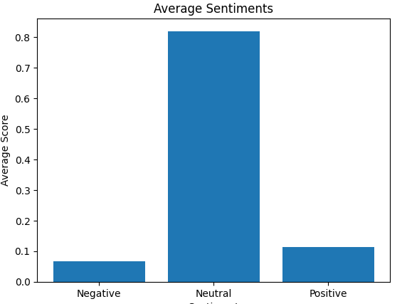

<h2> nltk-novel-exploration </h2>

>The true path to enlightenment and self-discovery lies not in blindly following established doctrines or seeking external validation, but in the personal journey of exploration, self-experience, and embracing the interconnectedness of all existence.

 

In this notebook it is explored the novel  "Siddhartha" by Hermann Hesse using **NLTK**

Some highlights from the notebook:

<h3>Tokenization </h3>

* The number of sentences is 1695 
* The number of words is 50987
* The average number of tokens per sentence is 30
* The number of unique tokens are 4565
* The number of total tokens after removing stopwords are 30066

<h4> Concordance with the word 'heart': </h4>

 iverse . Joy leapt in his father ’ s heart for his son who was quick to learn ,
joy , he still lacked all joy in his heart . Dreams and restless thoughts came 
ontent , the soul was not calm , the heart was not satisfied . The ablutions we
they did not relieve the fear in his heart . The sacrifices and the invocation 
id He reside , where did his eternal heart beat , where else but in one ’ s own 

<h4> Concordance with the word 'teach': </h4>

 s in the forest , then come back and teach me to be blissful . If you ’ ll find
 with his own eyes and has heard him teach . Verily , this made my chest ache w
, he did not believe that they would teach him anything new , but he had , just
ught you much , were still unable to teach you ? ” And he found : “ It was the 
 the ruins . Neither Yoga-Veda shall teach me any more , nor Atharva-Veda , nor
hings than what you ’ re supposed to teach me . And now let ’ s get to it : You
hing else . If I was able to say and teach it , I might be a wise man , but lik
ickly . But more than Vasudeva could teach him , he was taught by the river . I
is no other way for him who wants to teach . But the world itself , what exists
ivine and knows just as much and can teach just as much as the worshipped river
aborious life only to help them , to teach them ! Even with him , even with you 

<h3> SentimentIntensityAnalyzer </h3> 

´´´{'neg': 0.099, 'neu': 0.76, 'pos': 0.141, 'compound': 1.0}´´´

 Acording to this the novel wold be neutral a 76% of the time negative a 9.9% and positive a 14.1%  

